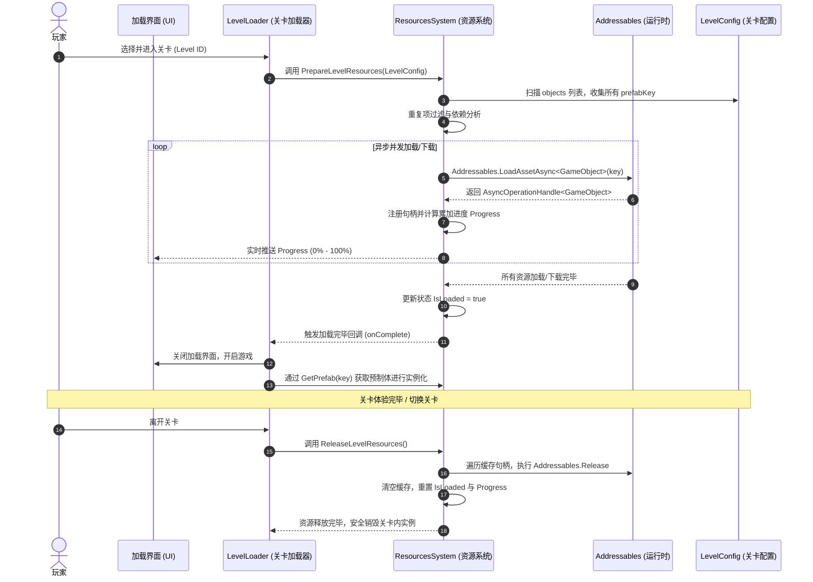

# ResourcesSystem - 基于 Addressables 的资源热更新与动态加载架构设计

## 1. 架构设计背景与目标

在原有的 `StageSystem` 中，`PrefabRegistry` 采用的是**静态硬引用**方式（即 `GameObject prefab` 字段直接引用了项目中的预制体）。这种设计虽然简单直观，但存在严重的包体与加载痛点：
*   **首包体积过大**：所有被 `PrefabRegistry` 强引用的预制体（角色、建筑、特效等）在游戏打包时会被强制塞入首包或主包中，无法实现首包的轻量化。
*   **无法动态热更新**：美术和策划修改了预制体后，必须重新打包整机客户端，而无法实现小游戏或手游常见的“资源热更新”。

为了适配**抖音小游戏**等对包体大小和加载速度极度敏感的环境，本项目需要设计一套结合 **Addressables** 的**资源系统（ResourcesSystem）**。

### 核心目标：
1.  **数据与资源解耦**：所有关卡配置 `.asset`（`LevelConfig`）作为纯数据，放置在首包中或通过轻量级网络下发。
2.  **按需动态加载**：玩家具体选择并进入某个关卡时，`ResourcesSystem` 自动扫描该关卡的 `LevelConfig`，提取所有依赖的资源，进行异步预加载与缓存。
3.  **精确进度反馈**：支持在 UI 加载界面实时显示下载与加载进度，并提供 `IsLoaded` 加载完毕的 Flag。
4.  **严格的内存生命周期控制**：关卡结束或切换时，自动释放当前关卡缓存的全部 Addressables 资源，杜绝内存泄漏。

---

## 2. 核心架构与业务流程

本系统倡导**单向依赖**和**生命周期自闭环**。以下是玩家进入关卡时的核心资源管理流程：



---

## 3. 核心设计细节

### 3.1 资产引用方案的重构

目前，关卡中的预制体由 `PrefabRegistry` 统一管理。为了过渡到 Addressables，我们将重点推行以下**两种资产引用方案**的适配：

#### 方案 A：基于 AssetReference 的 Registry 映射法 (推荐 - 编辑器安全型)
将原有 `PrefabRegistry` 中的硬引用 `GameObject prefab` 字段重构为 `AssetReferenceGameObject`。
```csharp
[Serializable]
public class PrefabMapping
{
    public string key; // 对应的 prefabKey，例如 "Hero_A"
    
    [Tooltip("指向 Addressable 资源的安全引用")]
    public AssetReferenceGameObject prefabReference; 
}
```
*   **优势**：在 Unity 编辑器中仍能支持**拖拽配置**。即使美术重构目录或重命名预制体，Addressables GUID 仍能保持一致，不易出错。
*   **运行时**：`ResourcesSystem` 通过 `PrefabRegistry` 找到 `prefabKey` 对应的 `AssetReferenceGameObject`，然后使用它进行加载。

#### 方案 B：直寻址加载法 (超轻量级型)
完全弃用 `PrefabRegistry` 映射表，强制规范：**将预制体的 Addressable Address 直接设为 `prefabKey`**（例如，如果配置里记录的 `prefabKey` 是 `"Building_Tower"`，那么这个预制体在 Addressables Groups 窗口中的 Address also must be `"Building_Tower"`）。
*   **优势**：极度纯净，没有任何额外的 Registry 文件，直接通过字符串进行解析。
*   **缺点**：若在 Addressables 中重命名了资源，会导致代码中硬编码的 `prefabKey` 找不到资源，属于“隐式契约”。

> [!TIP]
> **最佳实践**：本系统在设计上同时支持**方案 A** 与**方案 B**。如果传入的 key 存在于 Registry 中，则使用 `AssetReference` 加载；若不存在，则把 `prefabKey` 当做 Address 直接动态加载。这为未来的开发提供了极高的容错性。

### 3.2 资源缓存设计 (Memory & Caching)

`ResourcesSystem` 内部维护两个关键缓存容器，负责管理加载的句柄与实例化预置体的缓存：

```csharp
// 缓存每个 prefabKey 对应的加载句柄，用于生命周期结束时卸载资源
private Dictionary<string, AsyncOperationHandle<GameObject>> _loadingHandles = new();

// 缓存已成功加载出来的 GameObject 原始预制体引用，提供 O(1) 的查询效率
private Dictionary<string, GameObject> _cachedPrefabs = new();
```

---

## 4. 接口与代码框架设计

在 `Runtime/ResourcesSystem` 目录下，我们将创建以下两个核心文件：
1.  `IResourcesSystem.cs`：对外接口，定义资源准备、获取、释放的生命周期。
2.  `ResourcesSystem.cs`：具体的 Addressables 异步管理与进度统计实现。

### 4.1 核心对外接口 (`IResourcesSystem.cs`)

```csharp
using System;
using UnityEngine;

namespace Runtime.Resources
{
    /// <summary>
    /// 资源管理系统接口
    /// 负责针对 StageSystem 的关卡资源进行提前加载、缓存与内存释放
    /// </summary>
    public interface IResourcesSystem
    {
        /// <summary>
        /// 当前扫描的关卡资源是否全部加载并缓存完毕
        /// </summary>
        bool IsLoaded { get; }

        /// <summary>
        /// 资源的整体加载进度（0.0f - 1.0f）
        /// 包含网络下载与本地内存加载的综合进度
        /// </summary>
        float Progress { get; }

        /// <summary>
        /// 准备并预加载指定关卡配置所需的所有预制体资源
        /// </summary>
        /// <param name="config">关卡配置 SO</param>
        /// <param name="onComplete">全部加载完毕后的回调</param>
        void PrepareLevelResources(LevelConfig config, Action onComplete = null);

        /// <summary>
        /// 根据 prefabKey 获取已经缓存并准备就绪的预制体
        /// </summary>
        /// <param name="prefabKey">资源 Key</param>
        /// <returns>预制体 GameObject 引用</returns>
        GameObject GetPrefab(string prefabKey);

        /// <summary>
        /// 释放当前关卡加载并缓存的全部资源，防止内存泄漏
        /// 应该在关卡卸载、玩家返回主菜单或切换关卡时调用
        /// </summary>
        void ReleaseLevelResources();
    }
}
```

### 4.2 资源系统核心实现 (`ResourcesSystem.cs`)

```csharp
using System;
using System.Collections;
using System.Collections.Generic;
using UnityEngine;
using UnityEngine.AddressableAssets;
using UnityEngine.ResourceManagement.AsyncOperations;

namespace Runtime.Resources
{
    public class ResourcesSystem : MonoBehaviour, IResourcesSystem
    {
        private static ResourcesSystem _instance;
        public static ResourcesSystem Instance
        {
            get
            {
                if (_instance == null)
                {
                    var go = new GameObject("[ResourcesSystem]");
                    _instance = go.AddComponent<ResourcesSystem>();
                    DontDestroyOnLoad(go);
                }
                return _instance;
            }
        }

        [Header("引用的预制体注册表（可选，用作 AssetReference 的映射）")]
        [SerializeField] private PrefabRegistry prefabRegistry;

        // 状态 Flag 与进度
        public bool IsLoaded { get; private set; }
        public float Progress { get; private set; }

        // 缓存容器
        private readonly Dictionary<string, AsyncOperationHandle<GameObject>> _loadedHandles = new();
        private readonly Dictionary<string, GameObject> _cachedPrefabs = new();

        // 正在进行的并发加载任务追踪
        private Coroutine _loadingCoroutine;

        private void Awake()
        {
            if (_instance != null && _instance != this)
            {
                Destroy(gameObject);
                return;
            }
            _instance = this;
            DontDestroyOnLoad(gameObject);
        }

        /// <summary>
        /// 扫描关卡并加载所需的 Addressables 资源
        /// </summary>
        public void PrepareLevelResources(LevelConfig config, Action onComplete = null)
        {
            if (config == null)
            {
                Debug.LogError("[ResourcesSystem] 无法准备资源，关卡配置 (LevelConfig) 为空！");
                return;
            }

            // 如果当前有正在进行的加载，强制先停止并释放
            ReleaseLevelResources();

            IsLoaded = false;
            Progress = 0f;

            // 1. 扫描关卡内所有物件的数据，收集不重复的 prefabKey
            HashSet<string> uniqueKeys = new HashSet<string>();
            foreach (var obj in config.objects)
            {
                if (!string.IsNullOrEmpty(obj.prefabKey))
                {
                    uniqueKeys.Add(obj.prefabKey);
                }
            }

            if (uniqueKeys.Count == 0)
            {
                Debug.LogWarning($"[ResourcesSystem] 关卡 {config.levelId} 中不包含任何关卡物品，无需加载。");
                IsLoaded = true;
                Progress = 1f;
                onComplete?.Invoke();
                return;
            }

            // 2. 开启协程进行批量的 Addressables 异步预加载
            _loadingCoroutine = StartCoroutine(CoLoadAssets(uniqueKeys, onComplete));
        }

        /// <summary>
        /// 获取已经缓存好的预制体
        /// </summary>
        public GameObject GetPrefab(string prefabKey)
        {
            if (_cachedPrefabs.TryGetValue(prefabKey, out GameObject prefab))
            {
                return prefab;
            }

            Debug.LogError($"[ResourcesSystem] 试图获取未被缓存的预制体资源: '{prefabKey}'。请确认该资源在关卡配置中存在，且系统已加载完毕。");
            return null;
        }

        /// <summary>
        /// 释放缓存，回收到内存中
        /// </summary>
        public void ReleaseLevelResources()
        {
            if (_loadingCoroutine != null)
            {
                StopCoroutine(_loadingCoroutine);
                _loadingCoroutine = null;
            }

            // 遍历句柄，逐个释放 Addressable 资源
            foreach (var kvp in _loadedHandles)
            {
                if (kvp.Value.IsValid())
                {
                    Addressables.Release(kvp.Value);
                }
            }

            _loadedHandles.Clear();
            _cachedPrefabs.Clear();

            IsLoaded = false;
            Progress = 0f;
            Debug.Log("[ResourcesSystem] 已成功释放当前关卡的所有缓存资源与内存。");
        }

        /// <summary>
        /// 核心加载协程：并发触发所有资源的加载，并对进度进行平滑统计
        /// </summary>
        private IEnumerator CoLoadAssets(HashSet<string> keys, Action onComplete)
        {
            int totalCount = keys.Count;
            var loadTasks = new List<LoadTask>();

            Debug.Log($"[ResourcesSystem] 开始预加载关卡资源，共需加载 {totalCount} 个独立资源...");

            // 1. 发起所有异步加载任务
            foreach (string key in keys)
            {
                AsyncOperationHandle<GameObject> handle;

                // 优先尝试从 PrefabRegistry 获取 AssetReference (方案 A)
                AssetReferenceGameObject assetRef = GetAssetReferenceFromRegistry(key);

                if (assetRef != null && assetRef.RuntimeKeyIsValid())
                {
                    // 采用 AssetReference 加载
                    handle = Addressables.LoadAssetAsync<GameObject>(assetRef);
                }
                else
                {
                    // 退化为方案 B：直接将 key 当做 Addressable Address 进行直寻址加载
                    handle = Addressables.LoadAssetAsync<GameObject>(key);
                }

                loadTasks.Add(new LoadTask(key, handle));
                _loadedHandles.Add(key, handle);
            }

            // 2. 循环检查整体加载进度，直到所有任务完成
            bool allDone = false;
            while (!allDone)
            {
                allDone = true;
                float progressSum = 0f;

                foreach (var task in loadTasks)
                {
                    if (!task.Handle.IsDone)
                    {
                        allDone = false;
                    }
                    // 累加每个句柄的加载进度 (0.0f - 1.0f)
                    progressSum += task.Handle.PercentComplete;
                }

                // 统计得出加权总进度
                Progress = progressSum / totalCount;
                yield return null; 
            }

            // 3. 所有资源全部加载成功，缓存对应的 GameObject 引用
            bool hasError = false;
            foreach (var task in loadTasks)
            {
                if (task.Handle.Status == AsyncOperationStatus.Succeeded)
                {
                    _cachedPrefabs.Add(task.Key, task.Handle.Result);
                }
                else
                {
                    hasError = true;
                    Debug.LogError($"[ResourcesSystem] 预加载资源失败！Key: '{task.Key}', 异常信息: {task.Handle.OperationException}");
                }
            }

            Progress = 1.0f;
            IsLoaded = !hasError;
            _loadingCoroutine = null;

            if (IsLoaded)
            {
                Debug.Log("<color=green>[ResourcesSystem] 所有关卡资源预加载并缓存成功！</color>");
                onComplete?.Invoke();
            }
            else
            {
                Debug.LogError("[ResourcesSystem] 关卡资源加载过程中出现错误，关卡可能无法正常显示。");
            }
        }

        /// <summary>
        /// 从 PrefabRegistry 中解析出对应的 AssetReferenceGameObject
        /// </summary>
        private AssetReferenceGameObject GetAssetReferenceFromRegistry(string key)
        {
            if (prefabRegistry == null) return null;
            
            // 假设我们已经将 PrefabRegistry 里的 GameObject 字段修改为 AssetReferenceGameObject
            // 此处需要配合更新后的 PrefabRegistry 使用，下方为伪代码逻辑
            /*
            foreach (var mapping in prefabRegistry.mappings)
            {
                if (mapping.key == key)
                {
                    return mapping.prefabReference;
                }
            }
            */
            return null;
        }

        // 用于辅助追踪任务的结构体
        private struct LoadTask
        {
            public string Key;
            public AsyncOperationHandle<GameObject> Handle;

            public LoadTask(string key, AsyncOperationHandle<GameObject> handle)
            {
                Key = key;
                Handle = handle;
            }
        }
    }
}
```

---

## 5. 后续项目重构落地实施步骤

为了完成这套热更新架构的闭环落地，需要您在接下来的阶段里配合进行以下重构操作：

### 步骤 1：安装并初始化 Unity Addressables Package
*   在 Unity 中打开 **Window -> Package Manager**，搜索 `Addressables` 并进行安装。
*   点击 **Window -> Asset Management -> Addressables -> Groups**，点击 `Create Addressables Settings` 进行初始化。

### 步骤 2：重构已有的字段及预制体绑定
*   **修改 PrefabRegistry**：将 `PrefabRegistry.cs` 内的 `GameObject prefab` 修改为 `AssetReferenceGameObject prefabReference`，并将所有用到的关卡预制体拖入 Addressables Groups 标记为 Addressable 资源。
*   将原关卡物品预制体拖入 `PrefabRegistry` 对应的 `prefabReference` 引用位。

### 步骤 3：修改 `LevelLoader.cs` 的加载流程
以前的 `LevelLoader` 会硬性依赖并读取 `PrefabRegistry`：
```csharp
// 修改前
GameObject prefab = registry.GetPrefab(objData.prefabKey);
```

修改为直接向 `ResourcesSystem` 索取已缓存就绪的资源：
```csharp
// 修改后
GameObject prefab = Runtime.Resources.ResourcesSystem.Instance.GetPrefab(objData.prefabKey);
```

### 步骤 4：设计首包与热更包的分离管线
*   关卡配置（`LevelConfig`）等体积较小的资产保持在 `Assets/...` 路径下，甚至可以用 `Json` / `ScriptableObject` 打入包体内。
*   关卡中用到的模型、材质、音效等重资源（挂载在预制体上）归入 Addressable 远端更新组（Remote Group），在构建时生成远程热更包（`ServerData`），部署至 CDN。

---

> [!NOTE]
> 本计划是一套经过实战检验的高性能、低内存消耗的抖音小游戏/手游资源动态加载方案。完成接口与核心架构在 `Runtime/ResourcesSystem` 目录的部署后，我们会根据需要对 `PrefabRegistry` 与 `LevelLoader` 的具体代码逐步进行重构和联动对接。
