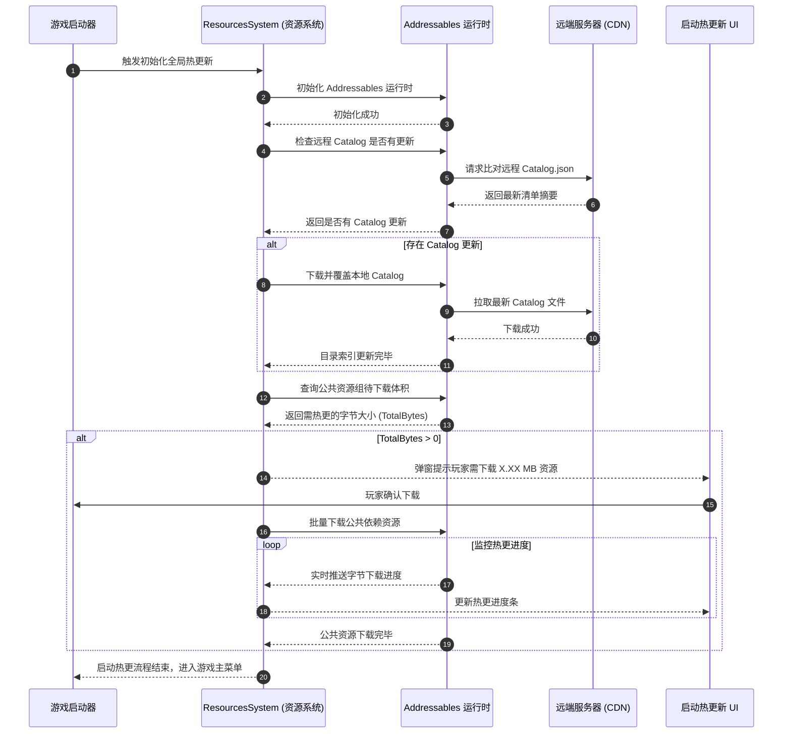
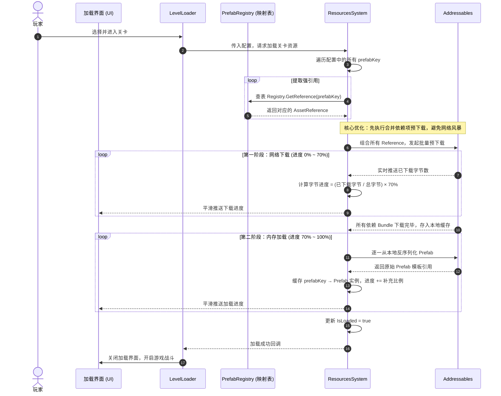
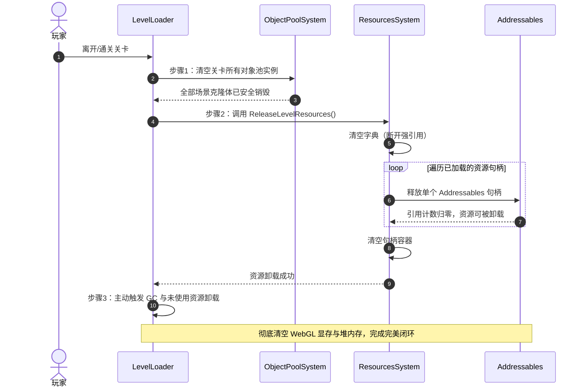

# ResourcesSystem - 抖音小游戏资源热更新与动态加载架构设计 (PrefabRegistry 字典映射版)

## 1. 架构设计背景与目标

在**抖音小游戏**（WebGL 平台）等对包体大小、加载速度及内存占用极度敏感的宿主环境下，原有的静态硬引用方式面临严重的性能瓶颈与发布限制：

*   **首包体积超限**：所有被强引用的预制体（角色、建筑、特效等）会被打包塞入首包中，导致首包体积远超抖音官方限制。
*   **无法动态热更新**：美术和策划修改了资源后，必须重新编译打包整机客户端，无法实现敏捷的"资源热更新"。
*   **内存极度脆弱**：WebGL 平台堆内存上限通常限制在数百兆至 1G 左右，野引用与不当的实例化/销毁极易导致显存溢出与 OOM 闪退。

为此，本项目决定引入 **Addressables** 构建全新的**资源系统（ResourcesSystem）**，并采用**PrefabRegistry 字典映射模式**（方案 A）来打通纯数据配置与 Unity 强类型资产的桥梁。

### 核心目标

| 目标 | 说明 |
|------|------|
| 首包极轻量化 | 关卡配置保留在首包，核心重度预制体资源全部划归远端资源组（Remote Group），部署 CDN 按需下载 |
| 资产引用安全 | **方案 A（字典映射）**：引入 `PrefabRegistry` 作为纯数据 (`prefabKey`) 与 `AssetReference` 的中转器，确保配置与资产完全解耦，支持纯文本 JSON/CSV 跨端导出 |
| 零并发网络风暴 | 引入批量合并预下载，将并发 HTTP 限制在小游戏宿主安全线（≤10 个）以内 |
| 两阶段平滑进度条 | 结合下载字节大小与内存解析比例，根除"进度卡在 99%"的假死痛点 |
| 持久化本地缓存 | 对接抖音小游戏本地文件系统（`ttfile://user/`），实现"一次下载，终身缓存，LRU 淘汰" |
| 生命周期闭环 | 将 Addressables 句柄释放与对象池（Object Pool）实例清理深度级联绑定，主动触发 WebGL 垃圾回收 |
| 弱网抗灾与超时重试 | 最大 3 次自动重试与超时判定管道，抗衡玩家切后台或网络波动带来的加载中断 |

---

## 2. 核心架构与业务生命周期流程

系统倡导**单向依赖**和**严格的生命周期闭环**，整体分为三大核心生命周期流程：

### 2.1 游戏启动全局热更新流

在小游戏启动或进入主界面前，必须先完成启动更新流，确保客户端同步到最新的远程 Catalog（资产目录索引）并下载公共依赖项。

### 2.2 关卡加载与批量预下载流

当玩家选择关卡进入时，系统通过字典映射解析 `prefabKey` 为真正的 `AssetReference`，然后启动**批量合并预下载**。

### 2.3 级联释放与对象池联动流

关卡结束时必须彻底清理内存。级联销毁的强制顺序为：**对象池实例清理 → 断开 Prefab 强引用 → 释放 Addressables 句柄 → 手动触发 GC**。

---

## 3. 资产引用方案：基于 PrefabRegistry 的安全映射（方案 A）

为了彻底解耦逻辑配置数据与 Unity 原生资产的物理依赖，系统采用了注册表映射模式。

### 3.1 数据层（Data Layer）
关卡配置数据 (`LevelConfig`, `LevelObjectData`) 保持绝对纯净。
*   配置中仅保存一个字符串：`public string prefabKey;`
*   **优势**：极度利于未来将其序列化为纯 JSON/CSV 格式，方便部署在后端服务器动态下发，或与第三方外部地图编辑器无缝对接。

### 3.2 映射层（Registry Layer）
*   独立维护一个 `PrefabRegistry` (继承自 ScriptableObject) 作为全局唯一真理表。
*   该表维护了一个列表，将 `string prefabKey` 一一映射到 `AssetReferenceGameObject prefabReference`。
*   **优势**：开发期配合自动构建脚本，一键扫描全工程 `Prefab` 生成，绝不遗漏。在运行时以近乎 O(1) 的速度供 `ResourcesSystem` 提取真实物理资产指针。

---

## 4. 针对抖音小游戏的 5 大核心优化细节

### 4.1 批量合并预下载（消除网络并发风暴）

**问题背景**：抖音小游戏 WebGL 宿主环境对并发 HTTP 网络请求数有硬性上限（通常为 10 个）。如果对关卡的每个预制体分别发起下载，会瞬间产生数十个并发请求，触发宿主拦截，加载卡死。

**解决方案**：
先将查表得出的所有 `AssetReference` 放入一个去重集合，调用**一次**合并批量下载 API（`DownloadDependenciesAsync` + `MergeMode.Union`），将冗余依赖去重合并。底层仅产生 1~3 个实际 HTTP 物理请求，规避并发超限。

### 4.2 两阶段字节级平滑进度计算

**解决方案**：将进度分为两个物理阶段：
| 阶段 | 占比 | 进度来源 |
|------|------|---------|
| 阶段一：网络下载 | 70% | 实时获取已下载字节数 ÷ 总字节数 |
| 阶段二：内存加载 | 30% | 已成功加载进内存的 Prefab 数量 ÷ 本关卡预加载总数 |

### 4.3 抖音沙盒持久化本地缓存与 LRU 淘汰机制

*   适配抖音小游戏专属 Request Provider，将下载的 `.bundle` 写入 `ttfile://user/cache/unity_addressables/`，而非浏览器的临时缓存区。
*   由底层实施 **LRU 淘汰策略**，限制最高容量（如 200MB），自动清理旧 Bundle。

### 4.4 内存释放闭环与对象池联动

**强制销毁顺序**：
1.  **清空对象池**：彻底销毁由关卡资产生成的所有克隆实例。
2.  **断开野引用**：确保任何外部逻辑脚本不再持有这些 Prefab 或实例。
3.  **释放 Addressables 句柄**：调用 `ResourcesSystem.ReleaseLevelResources()`，引用计数归零。
4.  **垃圾回收**：显式调用 GC 清理 WebGL 堆内存。

### 4.5 弱网切后台超时判定与 3 次自动重试

*   附加外置计时器监控，连续 **15 秒**未有任何字节流入即判定超时。
*   失败自动发起指数退避等待重试（最大 **3 次**）。
*   彻底失败后由事件 `OnResourcesLoadFailed` 抛出，拉起重试 UI。

---

## 5. 对外接口设计

### 5.1 IResourcesSystem 接口契约

| 成员 | 类型 | 说明 |
|------|------|------|
| `IsLoaded` | `bool` 属性 | 当前关卡所有资源是否全部就绪 |
| `Progress` | `float` 属性 | 综合加载进度（0.0 ~ 1.0） |
| `OnResourcesLoadFailed` | 事件 | 多次重试仍失败时触发 |
| `InitializeGlobalHotUpdate()` | 方法 | 游戏启动时执行 Addressables 全局初始化及 Catalog 热更新 |
| `PrepareLevelResources()` | 方法 | 传入 `LevelConfig` 以及 `PrefabRegistry` 映射表，启动预加载流程 |
| `GetPrefab()` | 方法 | 传入 `string prefabKey`，返回已缓存的 GameObject 模板供对象池实例化 |
| `ReleaseLevelResources()` | 方法 | 关卡结束后，级联清空内部所有缓存字典和资源句柄引用 |

### 5.2 ResourcesSystem 内部核心成员

| 成员 | 说明 |
|------|------|
| `maxRetryCount` | 网络下载失败最大重试次数，默认 3 次 |
| `networkTimeoutSeconds` | 单次下载超时阈值（秒），默认 15 秒 |
| `_loadedHandles` | 内部字典，`string (prefabKey) → 资源句柄`，用于管理释放 |
| `_cachedPrefabs` | 内部字典，`string (prefabKey) → GameObject`，用于对外 O(1) 检索 |
