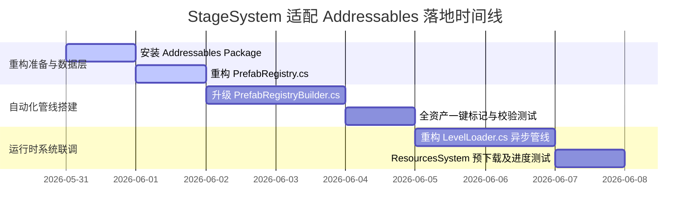

# StageSystem - 适配 Addressables 资源热更新架构调整计划书

为了配合全新核准的基于 **Addressables** 的 **ResourcesSystem（资源系统）**，原有的关卡编辑器与加载系统（`StageSystem`）需要进行相应的重构适配。

本计划书旨在以**“最少改动”**、**“零美术与策划心智成本”**、**“完美继承工作流”**为原则，对 `Runtime\StageSystem` 与 `Editor\StageSystem` 的核心类进行深度重构。

---

## 1. 核心适配架构对比

| 模块 / 类名 | 调整前 (静态硬引用模式) | 调整后 (Addressables 映射模式) |
| :--- | :--- | :--- |
| **PrefabRegistry (Model)** | 存储 `List<GameObject>`，强引用导致所有关卡预制体被打包进首包。 | 存储 `List<AssetReferenceGameObject>` 作为弱引用；同时**使用 `#if UNITY_EDITOR` 条件编译宏包裹原有的 `GameObject prefab` 物理强引用**。做到 Editor 状态下秒级免热更场景预览，打包出包时物理硬引用彻底剥离。 |
| **LevelLoader (Runtime)** | 强依赖 `PrefabRegistry` 实例，运行时同步生成，易造成内存碎裂和卡顿。 | **解耦注册表**，改从 `ResourcesSystem` 缓存池高速获取资源，提供一键整合“资源预热”+“实例化”的异步 API。 |
| **PrefabRegistryBuilder (Editor)** | 扫描配置后，将搜集到的 Prefab 裸对象赋给映射列表。 | **全自动 Addressable 标记器**：扫描缺失的预制体并自动打上 Addressable 标签，生成 `AssetReference`，同时保持对原生 `GameObject prefab` 字段在 Editor 内部的正常赋值，实现**“零策划配置成本”**。 |
| **LevelConfigEditor (Editor)** | 编辑器预览模式，通过 `AssetDatabase` 从全工程直接同步加载。 | **保持不变**：不依赖异步 ResourcesSystem，保证编辑期关卡预览的顺畅和丝滑，隔离运行时网络环境。 |
| **LevelExporter (Editor)** | 提取物体的 Prefab 源文件名作为 `prefabKey` 存入配置。 | **保持不变**：保持纯数据配置与 Unity 物理资产的完美文本化隔离，便于 JSON/CSV 跨端导出。 |

---

## 2. 详细调整方案与重构蓝图

### 2.1 数据映射层调整：重构 `PrefabRegistry.cs`

*   **修改方向**：在 `PrefabMapping` 中，为了兼顾**“编辑器同步预览与拖拽的敏捷度”**与**“实机出包物理引用的绝对解耦”**，我们**不直接删除原本的 `GameObject prefab` 强引用字段**，而是使用 **`#if UNITY_EDITOR` 条件编译宏** 将其包裹起来。同时，引入 `AssetReferenceGameObject prefabReference` 字段。
*   **代码调整蓝图（伪代码）**：
    ```csharp
    using System;
    using System.Collections.Generic;
    using UnityEngine;
    using UnityEngine.AddressableAssets; // 引入 Addressables

    [Serializable]
    public class PrefabMapping
    {
        public string key;
        
        [Tooltip("Addressable 资产的安全弱引用，避免物理打包强绑定")]
        public AssetReferenceGameObject prefabReference; 

#if UNITY_EDITOR
        [Tooltip("仅在编辑器下保留的物理强引用，方便编辑状态同步免热更预览，打包出包时会自动剥离，阻断包体硬关联")]
        public GameObject prefab;
#endif
    }

    [CreateAssetMenu(fileName = "PrefabRegistry", menuName = "StageSystem/Prefab Registry")]
    public class PrefabRegistry : ScriptableObject
    {
        public List<PrefabMapping> mappings = new List<PrefabMapping>();

        private Dictionary<string, AssetReferenceGameObject> _dict;

        public void Initialize()
        {
            if (_dict != null) return;
            
            _dict = new Dictionary<string, AssetReferenceGameObject>();
            foreach (var mapping in mappings)
            {
                if (mapping != null && !string.IsNullOrEmpty(mapping.key) && !_dict.ContainsKey(mapping.key))
                {
                    _dict.Add(mapping.key, mapping.prefabReference);
                }
            }
        }

        /// <summary>
        /// 提供给 ResourcesSystem 提取 Addressable 引用指针的接口
        /// </summary>
        public AssetReferenceGameObject GetReference(string key)
        {
            if (_dict == null) Initialize();
            
            if (_dict.TryGetValue(key, out AssetReferenceGameObject reference))
            {
                return reference;
            }
            return null;
        }
    }
    ```

---

### 2.2 运行时加载层调整：重构 `LevelLoader.cs`

*   **修改方向**：
    1.  解耦对 `PrefabRegistry` 的直接持有，转而依赖 `ResourcesSystem` 缓存。
    2.  提供一体化的 `LoadLevelAsync` 异步加载管线，统一游戏管理器（GameManager）的调度入口。
*   **代码调整蓝图（伪代码）**：
    ```csharp
    using UnityEngine;
    using System;
    using Runtime.Resources; // 依赖新的资源系统命名空间

    public class LevelLoader : MonoBehaviour
    {
        /// <summary>
        /// 【异步入口】负责从资源下载、解析、缓存到实例化、参数应用的一体化加载
        /// </summary>
        public void LoadLevelAsync(LevelConfig config, Action onComplete = null)
        {
            Debug.Log($"[LevelLoader] 开始调度关卡 {config.levelId} 的异步加载任务...");
            
            // 调度资源系统进行前置资源预热 (下载与缓存)
            ResourcesSystem.Instance.PrepareLevelResources(config, () =>
            {
                // 当资源系统报告 IsLoaded = true 后，在此同步生成实体
                SpawnLevelEntities(config);
                
                Debug.Log($"<color=lime><b>[LevelLoader] 关卡 {config.levelId} 异步实体加载与渲染已完成！</b></color>");
                onComplete?.Invoke();
            });
        }

        /// <summary>
        /// 从已缓存的原始预制体镜像生成关卡实体的内部逻辑
        /// </summary>
        private void SpawnLevelEntities(LevelConfig config)
        {
            foreach (var objData in config.objects)
            {
                // 核心：改从 ResourcesSystem 极速检索预置体，无硬编码硬引用
                GameObject prefab = ResourcesSystem.Instance.GetPrefab(objData.prefabKey);
                if (prefab == null) continue;

                // 实例化与还原 Transform
                GameObject instance = Instantiate(prefab);
                instance.transform.position = objData.transform.position;
                instance.transform.eulerAngles = objData.transform.rotation;
                instance.transform.localScale = objData.transform.scale;

                // 多态组件数据还原（对 ILevelComponent 接口成员注入 ApplyData）
                var levelComponents = instance.GetComponentsInChildren<ILevelComponent>(true);
                foreach (var savedData in objData.components)
                {
                    foreach (var comp in levelComponents)
                    {
                        if (comp.DataType == savedData.GetType())
                        {
                            comp.ApplyData(savedData);
                            break;
                        }
                    }
                }
            }
        }
    }
    ```

---

### 2.3 编辑器生成层调整：重构 `PrefabRegistryBuilder.cs`

*   **痛点**：如果改用 Addressables，每次新增关卡预制体，开发人员都要手动将其拖入 Addressables Group 并注册，心智负担极重。
*   **解决方案**：重构一键生成工具，当扫描到未被标记为 Addressable 的 Prefab 时，**利用 Addressables Editor API 自动将其标记为 Addressable，并自动生成 AssetReference 写入注册表**！同时，保留对 `#if UNITY_EDITOR` 包裹的 `prefab` 字段的直接硬关联赋值，方便常规预览。
*   **代码调整蓝图（伪代码）**：
    ```csharp
    #if UNITY_EDITOR
    using UnityEditor;
    using UnityEditor.AddressableAssets;
    using UnityEditor.AddressableAssets.Settings;
    using UnityEngine;
    using System.Collections.Generic;

    public class PrefabRegistryBuilder
    {
        private const string REGISTRY_PATH = "Assets/Resource/PrefabRegistry.asset";
        private const string ADDRESSABLE_GROUP_NAME = "LevelObjects"; // 关卡重资源分配的专属更新组

        [MenuItem("关卡构建/一键生成预制体注册表 (Addressable版)")]
        public static void BuildRegistry()
        {
            PrefabRegistry registry = AssetDatabase.LoadAssetAtPath<PrefabRegistry>(REGISTRY_PATH);
            // 1. 初始化或获取 SO (省略部分常规目录创建代码...)

            registry.mappings.Clear();

            // 2. 收集所有配置中使用到的不重复 prefabKey (省略部分扫描逻辑...)
            HashSet<string> usedKeys = GatherUsedKeys(); 

            // 3. 全局搜索匹配的 Prefab，并利用 Addressables 自动标记
            string[] prefabGuids = AssetDatabase.FindAssets("t:Prefab");
            var settings = AddressableAssetSettingsDefaultObject.Settings;
            
            // 自动寻找或创建关卡专属的 Addressable Group
            AddressableAssetGroup targetGroup = settings.FindGroup(ADDRESSABLE_GROUP_NAME);
            if (targetGroup == null)
            {
                targetGroup = settings.CreateGroup(ADDRESSABLE_GROUP_NAME, false, false, true, null);
            }

            int addedCount = 0;
            foreach (var guid in prefabGuids)
            {
                if (usedKeys.Count == 0) break;

                string path = AssetDatabase.GUIDToAssetPath(guid);
                GameObject prefab = AssetDatabase.LoadAssetAtPath<GameObject>(path);

                if (prefab != null && usedKeys.Contains(prefab.name))
                {
                    // 核心自动化：如果该预制体没有打上 Addressable 标签，自动标记它！
                    var entry = settings.CreateOrMoveEntry(guid, targetGroup);
                    if (entry != null)
                    {
                        // 强制将其 Address 设置为 prefab.name (符合方案 B 的直寻址，又能兼容方案 A)
                        entry.SetAddress(prefab.name); 
                    }

                    // 创建对应的 AssetReferenceGameObject
                    var reference = new AssetReferenceGameObject(guid);

                    // 在构建时，完美保留对 #if UNITY_EDITOR 宏下物理 prefab 强引用的赋值，同时保留 AssetReference
                    registry.mappings.Add(new PrefabMapping 
                    { 
                        key = prefab.name, 
                        prefabReference = reference,
                        prefab = prefab // 直接赋值，仅在 Editor 环境下起效与编译
                    });

                    usedKeys.Remove(prefab.name);
                    addedCount++;
                }
            }

            // 4. 保存资产并通知 Editor 刷新 (省略...)
            EditorUtility.SetDirty(registry);
            AssetDatabase.SaveAssets();
            
            EditorUtility.DisplayDialog("绑定成功", $"预制体 Addressable 注册表已生成并自动标记！\n\n共自动标记并绑定了 {addedCount} 个预制体。", "确定");
        }
    }
    #endif
    ```

---

## 3. 分阶段落地路线图 (Action Item List)



### 📋 关键步骤分解：

1.  **【步骤一：数据模型升级】**
    *   首先替换 `PrefabRegistry.cs` 内的字段定义，增加被 `#if UNITY_EDITOR` 包裹的 `GameObject prefab` 字段，以及 `prefabReference`。此改动会因条件编译只作用于 Editor，从而能完美不影响已存的关卡 `.asset` 配置。
2.  **【步骤二：升级一键生成工具】**
    *   在 Editor 层部署升级后的 `PrefabRegistryBuilder.cs`，运行一次“一键生成预制体注册表”，观察注册表中 `prefabReference` 被成功关联 GUID 的同时，原先的 `prefab`（硬引用）在 Inspector 面板中是否依旧正常拖入与显示。
3.  **【步骤三：重构运行时加载器】**
    *   更改 `LevelLoader.cs` 的运行时实例化获取逻辑，使其完全接入 `ResourcesSystem` 缓存池，配合 UI 的 Loading 进度进行完整的模拟器联调。
4.  **【步骤四：构建远端热更新包与剔除测试】**
    *   构建 WebGL 包。检验输出包体的数据尺寸，观察 `PrefabRegistry` 实例由于打包后缺少了非 Editor 环境下的 `prefab` 强引用，重型资源是否已成功被剥离出首包（完美剔除），仅剩下纯 GUID 数据索引。

---

> [!NOTE]
> 本计划书已根据您的复核意见进行了精细化升级。通过 **`#if UNITY_EDITOR` 条件编译宏保护物理 GameObject**，在编辑器状态下无缝兼容您现有的所有“场景预览”和“拖拽调试”逻辑，而无需每次都进行 Addressables 的本地打包；而在真正出包（如 WebGL/小游戏）编译时，该物理关联彻底斩断，真正实现 100% 远程按需热更。我已将此全新调整方案牢记！
